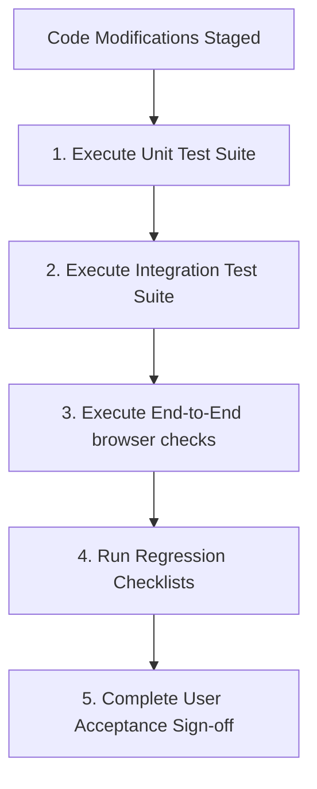

# Testing Workflow

This document defines the requirements, execution structures, and verification gates for testing codebases.

---

## 1. Overview & Objective

The objective of the Testing workflow is to establish a multi-tier test execution plan that verifies code correctness, prevents functional regressions, and ensures production readiness.

---

## 2. Step-by-Step Workflow

### Step 1: Unit Testing
- **Actions:** Run tests against utility modules and functions.
- **Rules:** Mock all databases and external API boundaries.

### Step 2: Integration Testing
- **Actions:** Test controller routers and database connectors against a test container.
- **Rules:** Clear test database state between tests.

### Step 3: End-to-End (E2E) Testing
- **Actions:** Execute browser simulation test scripts (Playwright) covering primary user checkout paths.

### Step 4: Regression & Acceptance Testing
- **Actions:** Run the test suite on the staging branch and obtain stakeholder validation approval.

---

## 3. Best Practices
- Target minimum 80% coverage on custom logic files.
- Automate test suite execution in the CI/CD pipeline.
- Write failing tests first during bug remediation (Test-Driven Development approach).
