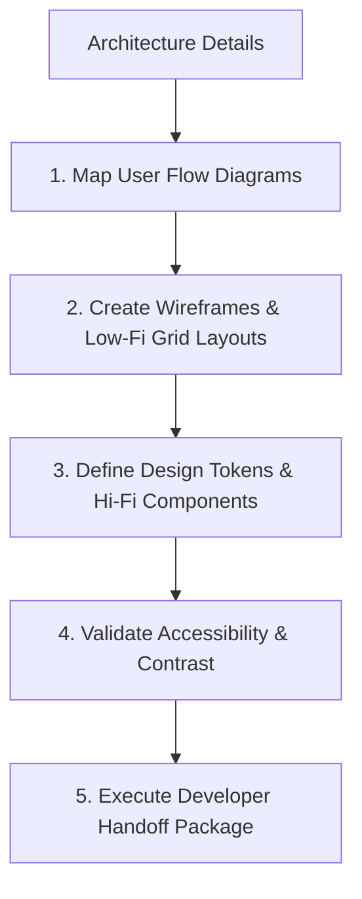

# UI/UX Workflow

This document defines the process for UI/UX research, wireframing, layout styling, and developer handoff.

---

## 1. Overview & Objective

The objective of the UI/UX workflow is to ensure that visual layouts are intuitive, responsive, accessibility-compliant (WCAG 2.1 AA), and structured for clean implementation by the Frontend Engineer.

---

## 2. Step-by-Step Workflow

### Step 1: User Flows
- **Actions:** Map out the exact step-by-step route a user takes to complete a task (e.g. user checkout journey).

### Step 2: Wireframing
- **Actions:** Define the basic structural grid of pages.
- **Rules:** Follow responsive grid patterns (columns, margins, offsets).

### Step 3: Design Tokens & Components
- **Actions:** Define colors, typography scales, spacing tokens, and custom UI components (buttons, input fields).
- **Rules:** Design system styles must map to token values.

### Step 4: Accessibility Check
- **Actions:** Verify contrast ratios (minimum 4.5:1 for normal text). Ensure keyboard tab mapping is planned.

### Step 5: Handoff
- **Actions:** Package mockups, CSS variables, typography maps, and SVG icons for developer ingestion.

---

## 3. Best Practices
- Design mobile-first layouts before scaling to large desktop viewports.
- Define explicit interactive states (hover, focus, active, loading) for every component.
- Ensure the Frontend Engineer reviews and accepts design structures before coding begins.
